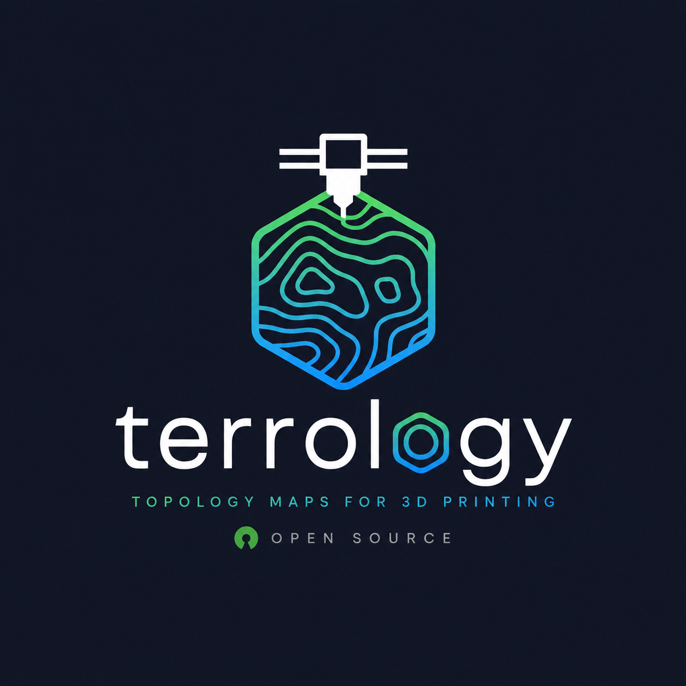
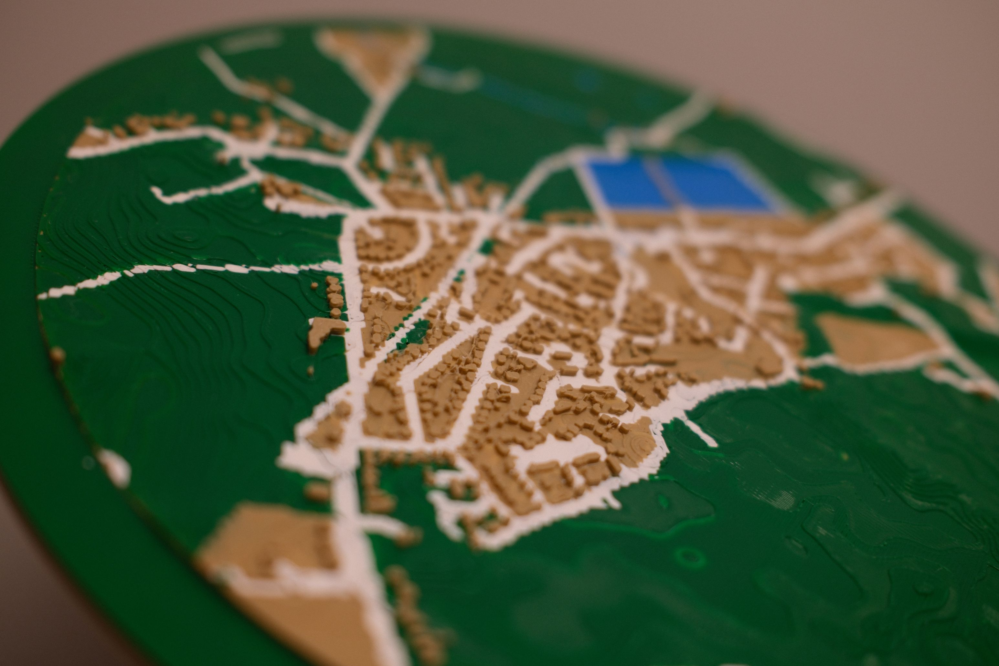
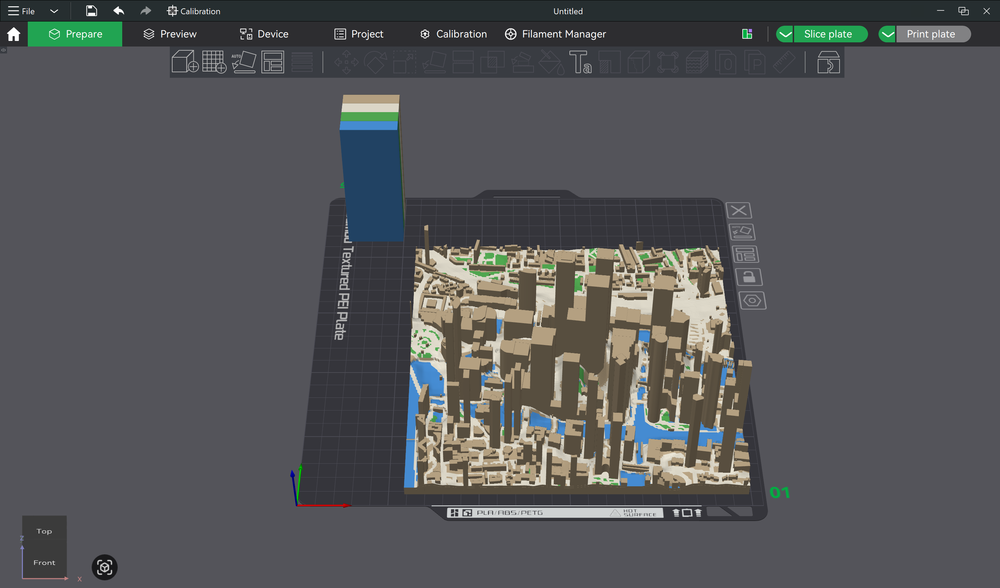
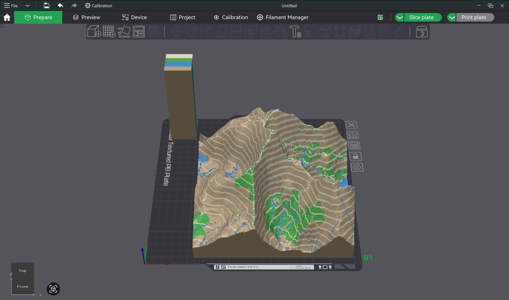
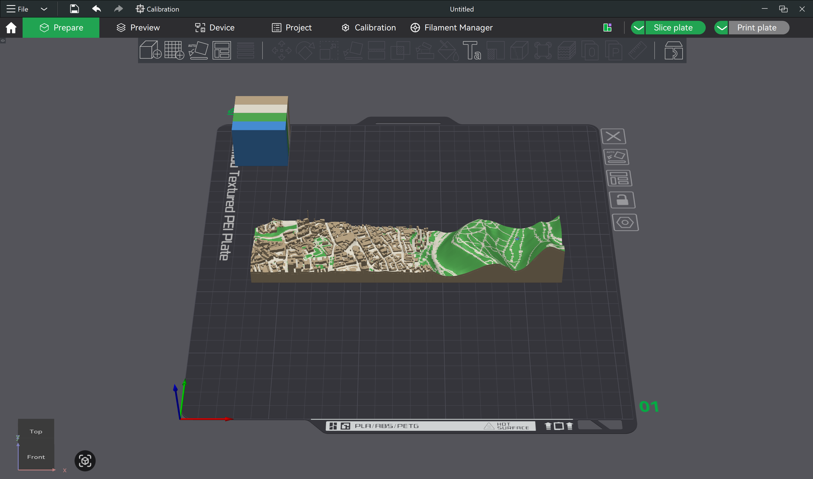
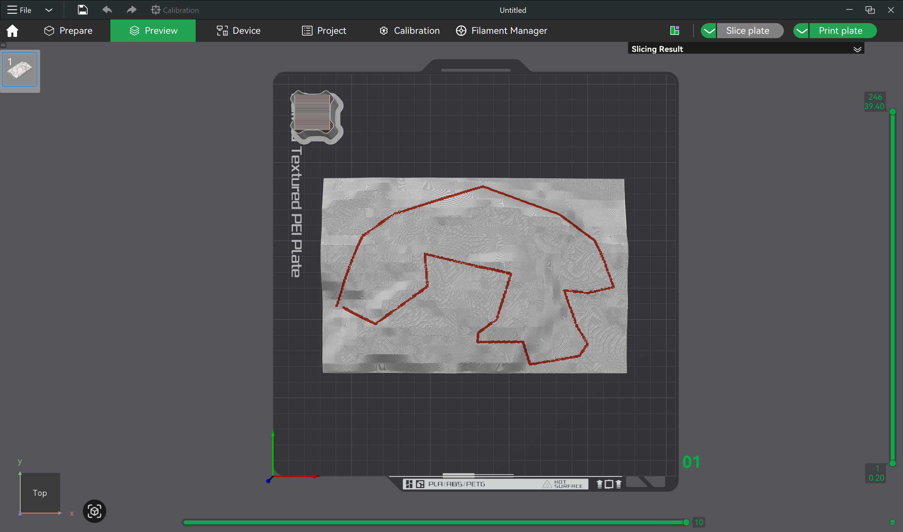
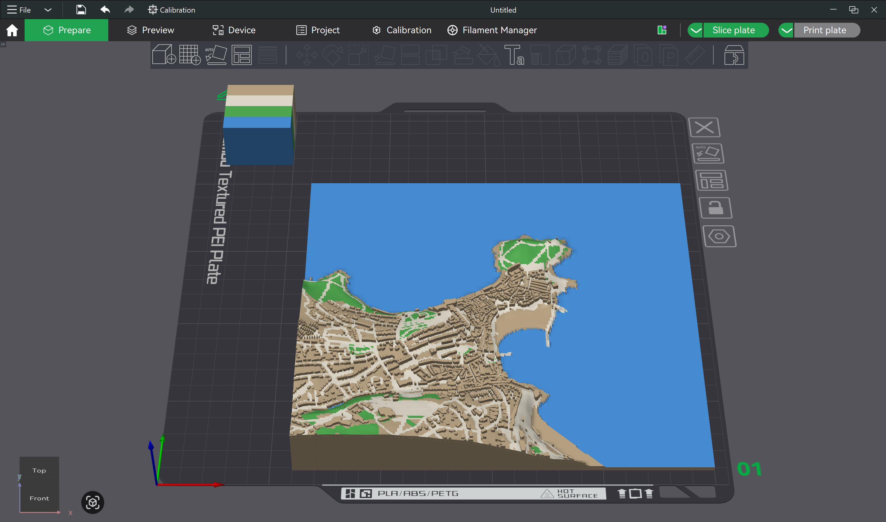

<p align="center">
  
</p>

<p align="center">Generate 3D-printable terrain and building models from OpenStreetMap and elevation data.</p>

---

<p align="center">
  
</p>

## Examples

<table>
<tr>
<td align="center"><br/><sub><b>Urban</b> — Canary Wharf, London</sub></td>
<td align="center"><br/><sub><b>Mountain</b> — Snowdon with 50 m contours</sub></td>
</tr>
<tr>
<td align="center"><br/><sub><b>Two-point</b> — Edinburgh Castle to Arthur's Seat</sub></td>
<td align="center"><br/><sub><b>Route</b> — Beacon Fell Country Park GPX</sub></td>
</tr>
<tr>
<td align="center" colspan="2"><br/><sub><b>Coastal</b> — St Ives, Cornwall</sub></td>
</tr>
</table>

---

## Installation

Install [uv](https://docs.astral.sh/uv/), then:

```bash
uv tool install git+https://github.com/twigley/terrology
terrology "Snowdon" --radius 500
```

Or clone and run directly:

```bash
git clone https://github.com/twigley/terrology
cd terrology
terrology "Snowdon" --radius 500
```

The default elevation source (`glo30`) requires no API key. The `srtm` and `aw3d30` sources require a free [OpenTopography API key](https://portal.opentopography.org/requestApiKey):

```bash
export OPENTOPOGRAPHY_API_KEY=your_key
```

Or save it once:
```bash
terrology --save-api-key <your_key>
```

---

## Usage

```bash
terrology <location> [options]
```

### Modes

**Single location** — square map centred on a point:
```bash
terrology "Canary Wharf, London" --radius 500
terrology 51.5074,-0.1278 --radius 600 --scale 4000
```

**Two locations** — rectangular map spanning both points (each near an edge):
```bash
terrology "51.5074,-0.1278" --to "51.5155,-0.0753"
terrology "Edinburgh Castle" --to "Arthur's Seat, Edinburgh" --buffer 0.08
```

**Area (GeoJSON)** — map clipped to a polygon boundary; everything outside is void:
```bash
terrology --area central_park.geojson
terrology --area manhattan.geojson --dem srtm
```
Draw or export a polygon from [geojson.io](https://geojson.io), QGIS, or any GIS tool. The first polygon in the file is used. No location argument is needed — the polygon provides the extent.

**Route (GPX)** — terrain-only map with the GPX track painted as a coloured line:
```bash
terrology --route my_ride.gpx
terrology --route trail.gpx --route-width 2.0 --terrain-exag 3
```

---

## Web interface

A browser-based UI is included. It provides a map for drawing or searching a location, all the key options, a 3D preview of the result, and a ZIP download.

**Run locally (installed):**
```bash
uv tool install "git+https://github.com/twigley/terrology[web]"
terrology-web
```

**Run locally (cloned repo):**
```bash
uv run uvicorn web.app:app --host 0.0.0.0 --port 8000
```

Then open `http://localhost:8000`.

**Run with Docker:**
```bash
docker build -t terrology .
docker run -p 8000:8000 -e OPENTOPOGRAPHY_API_KEY=your_key terrology
```

The API has a rate limit of 5 jobs/hour per IP by default. Set `TERROLOGY_NO_RATE_LIMIT=1` to disable it (useful for local use).

Each job runs in its own process so memory is fully released when it completes — the server returns to its idle footprint (~50 MB) between jobs. By default only one job runs at a time; set `MAX_CONCURRENT_JOBS=2` (or higher) if your instance has enough RAM (allow ~600 MB per concurrent job).

---

## Output files

| File | Description |
|---|---|
| `terrain.stl` | Full terrain solid — use for mono-colour printing |
| `buildings.stl` | Building extrusions only |
| `water.stl` | Water surface patch (lakes, rivers, sea) |
| `parks.stl` | Parks/woodland surface patch |
| `roads.stl` | Roads/paths surface patch |
| `model.obj` + `model.mtl` | Combined coloured model for multi-colour slicers |
| `model.3mf` | Bambu Studio 3MF with per-face colour metadata |

Import `model.obj` into Bambu Studio — it reads the MTL colours and lets you assign each material to a filament in the *Filament* panel.

The per-colour STLs (`water.stl`, `parks.stl`, `roads.stl`) are surface patches of the top layer only. Import them alongside `terrain.stl` into any slicer that handles multi-material via separate objects. Only files for colours present in the map are written.

### Materials

| Material | Used for |
|---|---|
| `terrain` | Terrain surface and buildings |
| `water` | Lakes, rivers, sea |
| `parks` | Parks, woodland, grassland |
| `roads` | Roads, paths |
| `route` | GPX route line (route mode only) |

Use `--colors` to limit the number of materials (e.g. `--colors 2` for a two-colour printer).

---

## Options

### Location / extent

| Flag | Default | Description |
|---|---|---|
| `location` | — | Place name or `"lat,lon"` — omit when using `--area` or `--route` |
| `--to` | — | Second location for a two-point map |
| `--area` | — | GeoJSON file whose first polygon defines the map boundary |
| `--route` | — | GPX file (route mode) |
| `--radius` | `500` | Radius in metres (single-point mode) |
| `--buffer` | `0.05` | Edge buffer as a fraction of span (two-point / area / route mode) |

### Model size & scale

| Flag | Default | Description |
|---|---|---|
| `--size` | `190` | Longest model dimension in mm |
| `--scale` | auto | Scale denominator — overrides `--size` (e.g. `3000` → 1:3000) |
| `--terrain-exag` | `2.0` | Vertical exaggeration of terrain height |

### Quality

| Flag | Default | Description |
|---|---|---|
| `--grid-size` | `200` | Terrain base mesh resolution N×N |
| `--color-grid-size` | `800` | Colour surface mesh resolution N×N — higher gives finer roads/paths |
| `--color-depth` | `1.5` | Depth (mm) colour features project into terrain — limits filament changes to surface layers |
| `--nozzle` | `0.4` | Nozzle diameter in mm. Both grid sizes are capped at `model_size ÷ (2 × nozzle)` so no cell is finer than the minimum printable feature. |
| `--dem` | `glo30` | Elevation dataset — see table below |

#### DEM sources

| Value | Resolution | Coverage | Notes |
|---|---|---|---|
| `glo30` *(default)* | 30 m | Global | Copernicus GLO-30 via public S3 — no API key needed |
| `srtm` | 30 m | Global (±60°) | SRTM GL1 via OpenTopography — smoother in dense urban areas |
| `aw3d30` | 30 m | Global | ALOS AW3D30 via OpenTopography — often sharper in mountains; better bridge deck elevation |

All three are Digital Surface Models (DSM) — they measure the top of the surface including buildings and trees, which adds height to dense urban areas. `srtm` tends to be slightly smoother than `glo30` in cities. Both `srtm` and `aw3d30` require a free OpenTopography API key.

### Colour

| Flag | Default | Description |
|---|---|---|
| `--colors` | `4` | Number of materials — priority order: terrain+buildings, water, parks, roads. Route mode always uses 2 (terrain + route). |
| `--route-width` | `1.5` | Route line width on the printed model in mm |
| `--contour-interval` | — | Draw elevation contour lines every N real-world metres (e.g. `--contour-interval 50`). Uses a contrasting colour from the existing palette — no extra filament needed. |

### Misc

| Flag | Default | Description |
|---|---|---|
| `--output` | `./output` | Output directory |
| `--save-api-key` | — | Save an OpenTopography API key to `~/.config/terrology/config` and exit |
| `--no-terrain` | — | Skip terrain — buildings and features only |
| `--no-buildings` | — | Skip building extrusion — terrain and features only |
| `--no-cache` | — | Ignore cached downloads |
| `--smooth-boundary` | `0` | Smooth the `--area` polygon outline with N iterations of Chaikin corner-cutting (e.g. `3`–`5`). Rounds sharp corners between GeoJSON vertices. |

---

## Tips

**API key** — set once as an environment variable so you don't have to pass it every run:
```bash
export OPENTOPOGRAPHY_API_KEY=your_key
```

**Caching** — OSM and elevation data are cached in `~/.cache/3dmap/`. Re-runs with the same area are fast. Use `--no-cache` to force a fresh download. If features look unexpectedly missing, try `--no-cache` — a failed fetch is cached as empty.

**Area / polygon maps** — draw your boundary at [geojson.io](https://geojson.io) and save as a `.geojson` file. Useful for irregular shapes (a river valley, a city district, a national park) where a rectangular bbox would include unwanted terrain. Everything outside the polygon is removed entirely.
```bash
terrology --area my_area.geojson --smooth-boundary 4
```

**Smooth polygon outlines** — if your GeoJSON polygon has few vertices, the map outline will have angular corners. Use `--smooth-boundary 3` to `5` to round them. More iterations pull the outline inward, so don't exceed ~6.

**Multi-colour printing** — import `model.obj` into Bambu Studio and assign each material name to a filament in the *Filament* panel. Buildings and terrain share the same material, so a 4-colour printer covers terrain, water, parks, and roads.

**Nozzle & triangle count** — the `--nozzle` default (0.4 mm) automatically caps grid resolutions so you never generate triangles the printer can't resolve. With a 0.6 mm nozzle the cap is tighter and files are smaller with no visible quality loss.

**Vertical exaggeration** — flat areas benefit from a higher `--terrain-exag` (try `3`–`5`). Mountainous areas may look better at `1.5`.

**Route maps** — the GPX bounding box is used automatically. Adjust `--buffer` to add more space around the track edges (default 5%). The route line width (`--route-width`) is in printed mm, not real-world metres, so it stays the same visual size regardless of map scale.

**Coastal maps** — coastlines and sea are detected automatically from OSM coastline data. Use `--dem srtm` for dense coastal cities to reduce building spikes in the terrain.

**Contour lines** — `--contour-interval` paints elevation contours using a colour already in your palette — no extra filament required. Choose an interval that matches the relief: 10–25 m for gentle hills, 50–100 m for mountains. Contours are invisible in 1–2 colour mode.
```bash
terrology "Zermatt, Switzerland" --radius 1500 --contour-interval 50
terrology "Peak District" --radius 3000 --contour-interval 25 --terrain-exag 3
```

**Bridges** — road and railway segments tagged `bridge=yes` in OSM sit at the correct elevated position rather than being depressed into the hillside.

**Slicers without OBJ support** — import `terrain.stl`, `water.stl`, `parks.stl`, and `roads.stl` together and assign each a filament. Only files for features present in the map are written.

---

## Data sources

Map data © [OpenStreetMap contributors](https://www.openstreetmap.org/copyright), licensed under the [Open Database Licence](https://opendatacommons.org/licenses/odbl/).

Elevation data provided by [OpenTopography](https://opentopography.org/). Datasets used:

- **GLO-30 (glo30)** — © DLR/ESA, distributed under CC BY 4.0
- **SRTM GL1 (srtm)** — NASA/USGS, public domain
- **AW3D30 (aw3d30)** — © JAXA, distributed under CC BY 4.0
